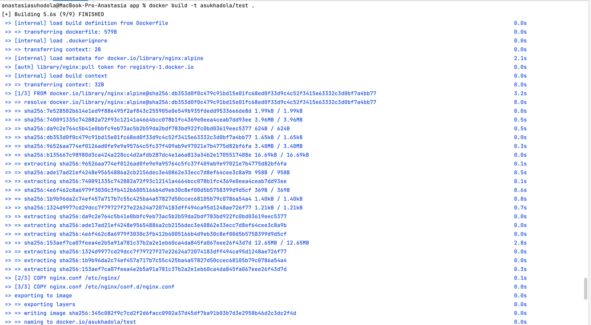

**Создание тестового приложения**

Для перехода к следующему этапу необходимо подготовить тестовое приложение, 
эмулирующее основное приложение разрабатываемое вашей компанией.

Способ подготовки:

**Рекомендуемый вариант:**
1. Создайте отдельный git репозиторий с простым nginx конфигом, который будет отдавать статические данные.
2. Подготовьте Dockerfile для создания образа приложения.

**Альтернативный вариант:**
1. Используйте любой другой код, главное, чтобы был самостоятельно создан Dockerfile.

**Ожидаемый результат:**

Git репозиторий с тестовым приложением и Dockerfile.
Регистри с собранным docker image. В качестве регистри может быть DockerHub или Yandex Container Registry, созданный также с помощью terraform.

Решение:

[nginx конфиг](app/nginx.conf)

[Dockerfile](app/Dockerfile)

```
docker build -t asukhadola/nginx-test-app .
docker run --rm -it --name nginx-test-app -p 8080:80 nginx-app
```


```
docker login -u "asukhadola"
docker  push asukhadola/nginx-test-app
```


Link:

[https://hub.docker.com/repository/docker/asukhadola/nginx-test-app/general](https://hub.docker.com/repository/docker/asukhadola/nginx-test-app/general)


